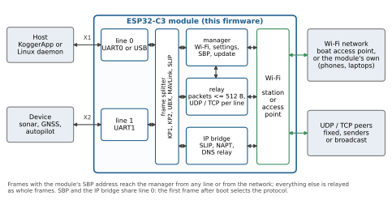
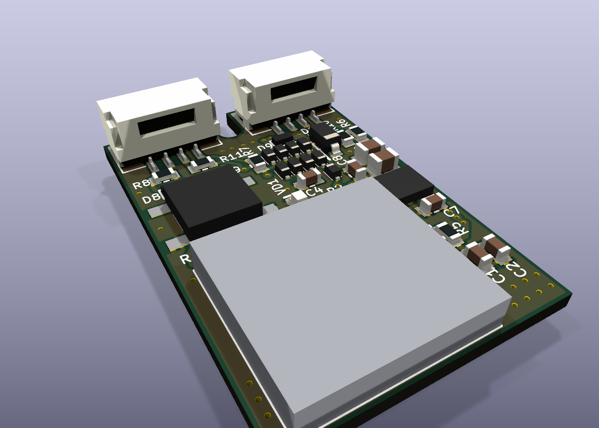

# Kogger Wi‑Fi Bridge

Firmware for a small ESP32‑C3‑MINI‑1U board that puts serial devices on Wi‑Fi.

- **Frame‑aware UART ↔ Wi‑Fi relay.** Two UART lines, each mapped to its own UDP port or TCP client.
  Traffic travels as whole protocol frames (Kogger SBP KP1/KP2, u‑blox UBX, MAVLink 1/2) packed into
  datagrams of at most 512 bytes. Anything else passes through as raw bytes, in order.
- **Kogger SBP device** (board ID 87) **on either port.** A host that speaks Kogger SBP uses X1 or X2, in either
  role, to configure Wi‑Fi, the relay and the network, to read state and statistics, and to update the firmware;
  everything except firmware updates also works over the network. The module answers discovery (`ID_VERSION` to
  address 0), so KoggerApp finds it without knowing its address, and it reports what it sees on each port: the rates,
  whether a host or devices sit there, the devices heard, the traffic by protocol. The update exchange is
  the one KoggerApp uses for Kogger devices; its file dialog needs `*.ufww` added ([docs/UPDATE.md](docs/UPDATE.md)).
  The Wi‑Fi settings need a host that implements the `ID_WIFI` / `ID_WIFI_NET` contract
  ([docs/SBP_WIFI.md](docs/SBP_WIFI.md)); `host/sbpframe.py` has Python helpers for the frame and for
  most payloads (state, scan, saved networks, radio, role, access point, addresses, lines, clients).
- **Station or access point.** As a station the module joins an existing network: up to 8 saved networks,
  auto‑connect to the strongest one. As an access point it runs its own network with a DHCP server for up
  to 10 clients.
- **IP bridge (optional).** IPv4 packets over SLIP on the serial link, NAT into Wi‑Fi. This is for a Linux
  host without a Wi‑Fi adapter; the daemon is in `host/`.
- **Safe updates.** Two firmware slots, the image is checked before the switch, and an image that does not
  prove itself is rolled back automatically.





## Example application

HeadUnit is a boat display computer, a Linux board that talks Kogger SBP to the boat's equipment. It has no usable
Wi‑Fi of its own, so the module sits on one of its UARTs at 3 Mbaud and joins the boat's access point. The equipment
on the boat sends Kogger SBP, MAVLink and UBX; the module relays this traffic between the head unit and the boat over
UDP. On the same port the module answers its own SBP address 87 and sends its Wi‑Fi state reports.

In the access‑point role the same board can be the boat‑side end: it bridges a sonar or autopilot
UART to phones and laptops on its own network.

## Key figures (firmware 0.18.0)

| | |
|---|---|
| Module | ESP32‑C3‑MINI‑1U (RISC‑V, 160 MHz, 4 MB flash, U.FL antenna connector) |
| Board | 20 × 30 mm, 4 layers; two JST GH 4‑pin connectors; supply 4.5–24 V on X1 (3.3 V / 1 A step‑down module) |
| Wi‑Fi | 802.11 b/g/n, 2.4 GHz, 20/40 MHz; Espressif LR mode optional; TX power 2–20 dBm in 11 steps |
| Roles | station (default) or access point (open, WPA2, WPA2/WPA3; channels 1–11; up to 10 clients) |
| Serial lines | X1 = UART0, X2 = UART1, equal for control and relay; 9600–5 000 000 baud, 8N1, set for each port; default 921600 on both |
| Relay | per line: off, UDP (fixed peer, last ≤ 4 senders, or broadcast) or TCP client; frames up to 4096 B |
| Control | Kogger SBP: `ID_WIFI` 0x57, `ID_WIFI_NET` 0x58, `ID_WIFI_SURVEY` 0x59 and the common device IDs, from any line or the network |
| Update | over SBP, from a wire or (since 0.17) the network; A/B slots of 1.875 MiB; SHA‑256 check; confirmation after 60 s, rollback at 180 s |
| Factory settings | station knowing the network `KoggerBridge` (build options `WB_FACTORY_SSID` / `WB_FACTORY_PASS`), lines relaying to 10.0.0.10:14444 / 14445; BOOT held 5 s resets the port rates, 10 s every setting |
| Image size | 0.95 MB, 48 % of a slot (0.16.0, UART build) |
| Serial throughput | baud / 10 bytes per second each way: 92 KB/s at 921600, 200 KB/s at 2 Mbaud |

The serial line, not Wi‑Fi, is the bottleneck at these rates. Measured figures, test conditions and charts
are in the [datasheet](docs/KoggerWiFi_datasheet.pdf) and in [docs/DESIGN.md](docs/DESIGN.md).

## Documentation

| Document | Contents |
|---|---|
| [docs/HARDWARE.md](docs/HARDWARE.md) | board, connectors, power, wiring, flashing without auto‑reset |
| [hardware/](hardware/) | KiCad project of the board, schematic PDF, Gerbers, BOM, pick‑and‑place |
| [docs/SBP_WIFI.md](docs/SBP_WIFI.md) | Kogger SBP contract: frame, common IDs, `ID_WIFI` 0x57, `ID_WIFI_NET` 0x58 |
| [docs/NETWORK.md](docs/NETWORK.md) | station / access point, AP settings, address and DHCP, UART lines and their ports |
| [docs/RELAY.md](docs/RELAY.md) | frame‑aware relay: framing, packing, buffers, back‑pressure, statistics |
| [docs/UPDATE.md](docs/UPDATE.md) | firmware update over SBP: procedure, safety argument, test log |
| [docs/PROTOCOL.md](docs/PROTOCOL.md) | IP bridge: SLIP framing, text commands, host daemon |
| [docs/PARAMETERS.md](docs/PARAMETERS.md) | every setting with default and range, build options, timing constants, buffers |
| [docs/DESIGN.md](docs/DESIGN.md) | architecture, tasks, memory, ESP‑IDF pitfalls, measurements, open issues |
| [docs/BUILD_AND_TEST.md](docs/BUILD_AND_TEST.md) | build, flash, PC tests, bench tools, host install |
| [docs/KoggerWiFi_datasheet.pdf](docs/KoggerWiFi_datasheet.pdf) | datasheet: summary, parameters and charts |
| [SECURITY.md](SECURITY.md) | security model and what to change before deployment |
| [CHANGELOG.md](CHANGELOG.md) | release history and verification status |

## Repository layout

| Directory | Contents |
|---|---|
| `firmware/` | ESP‑IDF project (C) |
| `host/` | Linux daemon for the IP bridge, CLI client, udev/systemd/NetworkManager files; Python mirrors of the wire formats |
| `tests/` | PC tests: the Python mirrors against the firmware's portable C, compiled on the PC, byte for byte |
| `tools/` | bench tools: flashing, SBP/relay/ping checks, update and packaging, charts and datasheet |
| `hardware/` | KiCad 10 project of the reference board and its fabrication outputs |
| `docs/` | documentation, charts, datasheet |
| `LICENSES/` | license notices of included third‑party material (MAVLink generated code) |

## Quick start

```
python tests/test_all.py                       # PC tests, no hardware: "43 checks, 0 failed"
cd firmware
idf.py -B build-uart -D SDKCONFIG=build-uart/sdkconfig -D "SDKCONFIG_DEFAULTS=sdkconfig.defaults;sdkconfig.defaults.uart" build
```

Flashing, the native‑USB variant and the bench checks are described in
[docs/BUILD_AND_TEST.md](docs/BUILD_AND_TEST.md). Tested with ESP‑IDF v5.5.5.

## Status

- **Verified on hardware (0.1–0.18):**
  - SBP device checks;
  - baud rates 9600 to 2 Mbaud on a bench adapter, 2/3/4 Mbaud on a head unit's UART;
  - IP bridge through NAT;
  - station auto‑connect;
  - firmware update, recovery from a lost chunk, a corrupted image refused;
  - relay to a boat network over UDP;
  - 0.11.0 installed on a head unit's module over SBP at 3 Mbaud (7/7 checks), all settings kept;
  - 0.12.0 on a bench module: the port rules (29/29 checks in both roles), the SBP device checks (38/38);
  - 0.12.0 on the head unit's module (7/7); a sonar on the access point's X2 seen on the head unit over an LR‑only
    module‑to‑module link;
  - 0.13.0 on a bench module: both BOOT resets (5 s: only the port rates; 10 s: factory settings), the factory station
    lines, a module set up under an earlier firmware keeping its X2 rate and access point after the update, both ports
    accepting 5 000 000 baud;
  - 0.13.0 and 0.14.0 on the head unit's module (7/7 each), every saved setting read before and compared after
    (`tools/module_state.py`);
  - 0.14.0: 60 requests at once all answered (58 on 0.13), a mixed burst of ten request types answered in full;
  - 0.15.0: a port rate set through that very port saved at once and kept across a reboot; the BOOT 5 s press
    restoring 921600 on both ports with every other setting kept;
  - 0.16.0: a channel survey in the station role - 11 channels swept, the pages, the flags and the refusals
    (`tools/bench_survey.py`), with the Wi-Fi link back afterwards;
  - 0.18.0: the first firmware update over the air - an access-point module updated through a head unit's relay
    (7/7, every setting kept); the link rate on both ends of a b/g/n link, 11n MCS7 with short guard interval both
    ways (`tools/bench_linkrate.py`); an image that could not be confirmed over a busy LR link rolled back to the
    previous one at the next power-on.
- **Not yet verified on hardware:** the channel survey in the access-point role; what the LR rate field of a
  received frame means (0x1A seen on every frame of an LR link); data at 5 Mbaud (the bench adapter stops at 2 Mbaud); the kept station lines of a
  module updated from 0.12; two factory modules relaying to each other; the 0.11 transmit fix under a saturated 921600 port; an abandoned transfer; a host on X2; the native USB variant; the IP bridge daemon on a Linux host; LR range and throughput over distance.

The status of each release is in [CHANGELOG.md](CHANGELOG.md).

## License

MIT, © 2026 KOGGER LLC, <https://kogger.tech>. See [LICENSE](LICENSE). Third‑party notices: [THIRD_PARTY.md](THIRD_PARTY.md).

The KOGGER logo on the bottom silkscreen of the board is not licensed under the MIT License. The fab zip in
`hardware/outputs` includes it: before making boards that KOGGER LLC does not supply, delete the logo from B.SilkS
and regenerate the outputs with `tools/make_hw_outputs.py`.
