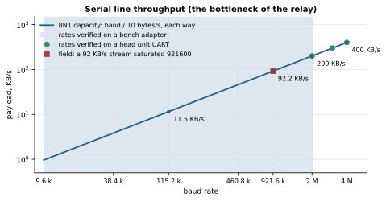
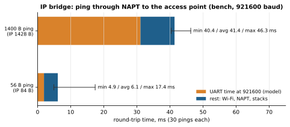

# Design

The module was built so that a boat head unit (an RK3588 Linux display computer) could reach the boat's
Wi‑Fi access point, since the head unit had no usable Wi‑Fi of its own. It grew into a general UART ↔ Wi‑Fi bridge with
two lines, a station and an access‑point role, and safe updates.

## Why it is built this way

| Fact | Consequence |
|---|---|
| The ESP32‑C3 has no USB OTG, only a fixed USB Serial/JTAG controller (CDC‑ACM + JTAG) (per the ESP32‑C3 technical reference) | the module cannot appear as a USB network adapter to the host |
| The head unit's kernel (6.13) has no `CONFIG_PPP` / `CONFIG_SLIP` and no such modules, but has `CONFIG_TUN=y`, `CONFIG_USB_ACM=m`, `CONFIG_USB_SERIAL_CP210X=m` | pppd/slattach are impossible, so the IP bridge carries packets with its own daemon through a TUN device |
| The head unit ships Python 3.12 without pyserial; systemd‑resolved is active, and NetworkManager runs the Ethernet (metric 100) | the daemon uses only the standard library (termios); DNS through `resolvectl` |
| KoggerApp already talks Kogger SBP to serial devices and can update their firmware | the module is an SBP device on the same port: any SBP host can configure it, and KoggerApp's firmware upgrade works without new transport code |
| The boat's equipment sends Kogger SBP, MAVLink and UBX | the relay keeps frames whole and recognises all three by their own checksums |

## Structure

Firmware (ESP‑IDF 5.5, C):

| File | Role |
|---|---|
| `main.c` | init order: settings, netif, Wi‑Fi, access point (if that role), radio, bridge, manager, relay, lines, SBP device |
| `link.c` | host link (UART0 or USB Serial/JTAG): receive and transmit tasks, one port for SBP and SLIP, whole‑unit transmit ring |
| `uline.c` | line 1 (UART1): receive and transmit tasks, whole‑unit transmit ring |
| `kframe.c`, `kpack.c`, `mavcrc.c` | relay framer (KP1, KP2, UBX, MAVLink 1/2), packer (≤ 512 B), MAVLink table |
| `relay.c` | both lines ↔ UDP/TCP: packet pool, send task, network task (`select`), peers |
| `sbp.c`, `sbpdev.c` | Kogger SBP frame codec; common device IDs; reply channels |
| `manager.c` | Wi‑Fi station and AP events, saved networks, `ID_WIFI`, text commands, supervision; the only task that changes state |
| `netctl.c`, `netcfg.c`, `wifiap.c` | `ID_WIFI_NET`; settings with validation in NVS; access point and DHCP server |
| `radio.c` | power, protocols, bandwidth, power save |
| `ota.c` | update over SBP into the inactive slot, validation, self‑confirmation |
| `bridge.c`, `frame.c`, `proto.c` | IP bridge: point‑to‑point lwIP netif without ARP, NAPT, DNS relay; SLIP + CRC‑16 framing; text lines |
| `wifistat.c` | Wi‑Fi interface traffic, bytes per second |

The portable parts (`frame.c`, `proto.c`, `sbp.c`, `kframe.c`, `kpack.c`, `mavcrc.c`) compile on a PC. `tests/test_all.py`
compares them byte for byte with the Python mirrors in `host/`.

Host (`host/`): `espwifi_bridge.py` (daemon, systemd), `espwifi_ctl.py` (CLI client; on a bench it talks to the module
directly over a serial port), udev rule `/dev/espwifi`, and a NetworkManager setting that leaves `espwifi0` alone.

Task priorities and stacks are in [PARAMETERS.md](PARAMETERS.md) §6. Receive tasks run highest and only copy; the
manager owns all state and is fed by a queue; Wi‑Fi events always find room in it (8 slots reserved).

## Throughput

- **UART**: 8N1 carries baud / 10 bytes per second each way; 92 KB/s at 921600, 200 KB/s at 2 Mbaud, 400 KB/s at
  4 Mbaud. SLIP escaping adds < 1 % on average. At these rates the serial line, not Wi‑Fi, is the bottleneck.
- **Measured at 921600:** a 1435‑byte IP frame takes ≈ 15.6 ms on the wire each way, so the IP bridge tops out at
  ≈ 90 KB/s per direction. A boat stream of ~92 KB/s saturated a 921600 port in the field.
- **USB Serial/JTAG**: full‑speed USB (12 Mbit/s) with 64‑byte packets. The real rate was not measured; 1–4 Mbit/s is
  an assumption.
- **Python daemon**: an inference, several Mbit/s on an RK3588; not a bottleneck on these links.

## ESP‑IDF pitfalls found on the way

Each item was found in this project; ESP‑IDF 5.5.5 unless stated.

1. **`uart_write_bytes()` with a transmit ring spins.** It waits properly only for the transaction header, then polls
   for ring space without sleeping (`esp_driver_uart/src/uart.c` lines 1589–1598). A transmit task above the idle task
   priority starves everything below it whenever the line is saturated, and the task watchdog reboots the chip. Rule:
   no `tx_buffer_size` when a high‑priority task writes and the stream can exceed the line; keep your own ring instead.
2. **USB Serial/JTAG refuses writes larger than its ring.** `usb_serial_jtag_write_bytes()` with more bytes than the ring
   never succeeds, and the host link stalls for good. Writes are capped at the ring size.
3. **`pdMS_TO_TICKS(5)` is 0 at `CONFIG_FREERTOS_HZ=100`.** `uart_read_bytes(..., 0)` became non‑blocking, the
   priority‑12 receive task spun, `app_main` never reached the manager start, and a `NULL` queue was used. Every wait
   now goes through `LINK_TICKS()`, which is at least one tick.
4. **UART events are dropped when the event queue is full.** Receive reads everything buffered, not exactly `ev.size`,
   and the event queue is reset before the input is flushed on overflow.
5. **The RX pin is not pulled up** when routed through the GPIO matrix (`uart.c`). An unconnected RX floats and noise
   becomes data. The firmware enables the pull‑up itself.
6. **AP channel outside the default country ("01", channels 1–11) is refused** by the driver; after a reboot the
   driver's own open AP could come up. The firmware refuses 12–13 and falls back to safe defaults.
7. **esp_netif starts a never‑started DHCP server on AP start** (`esp_netif_lwip.c`). A server disabled by
   configuration came back after an AP restart until the firmware stopped it after every start.
8. **The DHCP server holds 8 leases by default** (`CONFIG_LWIP_DHCPS_MAX_STATION_NUM`). With 10 clients admitted, a
   ninth client took the oldest lease away.
9. **The DHCP server refuses a one‑address pool** (`esp_netif_lwip.c`). The firmware validates with the same rules.
10. **`OFFER_DNS` already exists in `dhcpserver.h`.** The firmware's own flags are named `IPCFG_OFFER_*`.
11. **An event‑group wait on a bit that stays set returns at once.** A network task waiting for "Wi‑Fi up" without
    clearing it spun while Wi‑Fi was up (0.7/0.8 bug). The task now waits only for the reset bit while Wi‑Fi is up.
12. **`esp_wifi_get_protocol/bandwidth` report the configuration, not the negotiated link.** The real width shows in
    the negotiated PHY mode (HT20/HT40).
13. **Transmit power is applied in 11 steps** (`esp_wifi.h`), and country information from the AP may lower it after
    connecting, so the module re‑applies it after every connection.

## Measurement log

Bench: a CP2105 USB‑UART adapter at 921600 baud, UART build, ESP‑IDF 5.5.5.

| Version | Test | Result |
|---|---|---|
| 0.1.0 | first flash | the module rebooted on any control frame; cause: zero‑tick waits at HZ = 100 (pitfall 3); fixed |
| 0.1.0 | smoke test (`bench_flash.py`) | 11/11 PASS; free heap 154 KB |
| 0.1.0 | connect to a boat access point | CONNECTED, RSSI −46 dBm; the boat network offers no gateway or DNS, so the DNS relay answers SERVFAIL |
| 0.1.0 | ping through the bridge (`bench_ping.py`) | module: 0 % loss, RTT ≈ 4 ms. Through NAPT to the AP: 30/30 × 56 B, RTT 4.9/6.1/17.4 ms (min/avg/max); 30/30 × 1400 B (IP 1428 B), RTT 40.4/41.4/46.3 ms, data identical. Counters matched packet by packet |
| 0.1.0 | power cycle | auto‑connect without commands: SEARCHING +0 s → CONNECTING +2.4 s → CONNECTED +7.6 s |
| 0.2.0 | SBP device (`bench_sbp.py`) | 16/16 PASS; IP bridge regression 11/11 |
| 0.2.0 | baud switching via `ID_UART` | 28/28 PASS: 9600 … 460800, 1 000 000, 1 200 000, 1 500 000, 2 000 000 and back to 921600 |
| 0.3/0.4 | update over SBP | 885 KB in 80 s (10.8 KB/s); lost chunk recovered; corrupted image refused ([UPDATE.md](UPDATE.md)) |
| 0.7.0 | relay in the field (head unit ↔ boat, UDP) | ~270 datagrams, ~890 frames in 8 s, no loss |
| 0.10.0 | field (head unit) | update 0.7 → 0.10 over a saturated port, 5/5; 2/3/4 Mbaud set over SBP; relay in line 0 |
| 0.11.0 | field (head unit), 3 Mbaud | update 0.10 → 0.11 over SBP, 7/7: 932 512 B in 50.4 s (18.1 KB/s), no repositions, confirmed after 65 s; connected to the boat AP 4.5 s after start; settings kept; the reset reason reads back from v1 |

An observation at 0.2: with no relaying, the Wi‑Fi interface received ~5.8 KB/s and sent ~1.9 KB/s. The inference is
that the boat's access point sends datagrams to every client, about 30 per second of ~200 bytes, and the module's lwIP
answers each with an ICMP "port unreachable" (~65 bytes). What those datagrams are was not checked.

## Open issues

1. **NAT blocks inbound traffic** on the IP bridge. The host sees the boat network only "from inside out". Devices that
   must reach the host on their own (UDP to a known address, broadcast discovery) need port forwarding on the ESP
   (`ip_portmap_add`) or a broadcast relay. The relay mode does not have this limitation.
2. **Not verified on hardware:** the 0.11 transmit fix under a saturated 921600 port; rollback of an unconfirmed image and an abandoned transfer; the access‑point role; UART line 1; writing `ID_WIFI_NET` settings; the native USB variant; the IP bridge daemon on a Linux host.
3. **Faster auto‑connect:** trying the last good network before scanning would save ≈ 2 s; not done.
4. **Signed images** are not implemented ([UPDATE.md](UPDATE.md), [SECURITY.md](../SECURITY.md)).
5. **The LED** on GPIO0 is unused.
