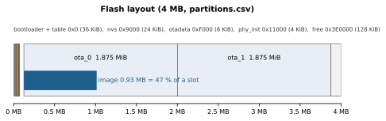

# Parameters

Every setting of firmware 0.11.0 with its default and range, the build options, the timing constants and the buffers.
The values are taken from the source (`firmware/main/*.c`, `Kconfig.projbuild`, `sdkconfig.defaults`,
`partitions.csv`); the file is named where it helps.

## 1. Run‑time settings (saved in NVS, namespace `wb`)

### Host port and SBP identity (`sbpdev.c`)

| Setting | Default | Range | Set with | Saved |
|---|---|---|---|---|
| Line 0 baud rate | 921600 (build option) | 9600 … 4 000 000 | `ID_UART` v0 | by `ID_FLASH` v0 |
| Boot SBP address | 0 | 0 … 255 | `ID_UART` v2 | by `ID_FLASH` v0 |
| Current SBP address | boot address, or the bridging address while a line bridges | 0 … 255 | `ID_UART` v1 | no (one boot across an update or role change) |
| Link report period | 1000 ms | 0 (off), 100 … 60000 ms, clamped | `ID_WIFI` v1 | by `ID_FLASH` v0 |

### Station (`manager.c`)

| Setting | Default | Range |
|---|---|---|
| Saved networks | none | up to 8; SSID 1–32 bytes, password 0–64 bytes; least recently used replaced when full |
| Auto‑connect | on at boot when saved networks exist | `ID_WIFI` v4 actions 0/1, text `AUTO`/`DISCONNECT` |
| DHCP hostname | `headunit-wifi` | build option `WB_HOSTNAME` |

### Radio (`radio.c`, `ID_WIFI` v7)

| Setting | Default | Range |
|---|---|---|
| TX power limit | 80 (20 dBm) | 8 … 80 in 0.25 dBm; 81 … 84 stored as 80; applied in 11 steps (2 … 20 dBm) |
| Protocols | b/g/n (0x07) | 0x01 b, 0x03 b/g, 0x07 b/g/n, 0x08 LR, 0x0F b/g/n + LR; LR only is refused in the AP role over SBP (the text `RADIO` command does not check it, known issue) |
| Bandwidth | 20 MHz | 20 / 40 MHz (40 only with 11n) |
| Power save | off | off, MIN_MODEM, MAX_MODEM (not applied in the AP role) |

### Role and access point (`netcfg.c`, `ID_WIFI_NET` v0/v1)

| Setting | Default | Range |
|---|---|---|
| Role | station | station / access point; takes effect at boot |
| AP name | `Kogger-XXXX` (last two bytes of the AP MAC) | 1–32 bytes |
| AP security | WPA2 | open / WPA2 / WPA2+WPA3 |
| AP password | `kogger1234` (**public, change it**) | 8–63 characters; never read back |
| AP channel | 6 | 1 … 11 |
| AP hidden | no | yes / no |
| AP client limit | 4 | 1 … 10 |

### Access point address and DHCP (`netcfg.c`, `ID_WIFI_NET` v2)

| Setting | Default | Range |
|---|---|---|
| AP address / netmask | 10.0.0.10 / 255.255.255.0 | contiguous mask, not /0 or /32; address not network/broadcast |
| DHCP server | on | on / off |
| Pool | 10.0.0.11 … 10.0.0.30 | inside the subnet, start < end, AP address outside, ≤ 100 addresses |
| Lease | 120 min | 1 … 2880 min |
| Offer gateway / DNS | no / no | each yes / no |

### UART lines (`netcfg.c`, `ID_WIFI_NET` v3/v6, `ID_WIFI` v5)

| Setting | Line 0 (X1) | Line 1 (X2) |
|---|---|---|
| Mode, station role | off | off |
| Mode, access‑point role | UDP | UDP |
| Destination | senders | senders |
| Peer port (rport) / local port (lport) | 14444 / 14444 | 14445 / 14445 |
| Peer address (fixed, TCP) | — | — |
| Baud | `ID_UART` (921600) | 115200 (9600 … 4 000 000) |
| Pins TX / RX | 21 / 20 (build) | 5 / 4, from {0, 1, 3, 4, 5, 6, 7, 10}, −1 = off |

| Setting | Default | Range |
|---|---|---|
| Own SBP address while a line bridges | 87 (station), 88 (access point) | 1 … 255 |
| Relay destination "senders" | up to 4 senders | a sender is forgotten after 60 s of silence |

Role defaults apply while a line has not been saved; saved lines are shared by both roles.

## 2. Build options (`idf.py menuconfig` → "HeadUnit Wi‑Fi bridge")

| Option | Default | Meaning |
|---|---|---|
| `WB_LINK` | USB Serial/JTAG | host link: native USB, or UART (`sdkconfig.defaults.uart` selects UART) |
| `WB_LINK_UART_NUM` | 0 | UART number of the host link |
| `WB_LINK_UART_BAUD` | 921600 | default rate of the host link (run time: `ID_UART` + `ID_FLASH`) |
| `WB_LINK_UART_TX` / `RX` | 21 / 20 | host link pins (X1) |
| `WB_LINK_UART_RTS` / `CTS` | −1 / −1 | hardware flow control pins, −1 = none |
| `WB_BRIDGE_IP` / `WB_HOST_IP` | 10.99.0.1 / 10.99.0.2 | IP bridge point‑to‑point addresses (/30) |
| `WB_OTA_CONFIRM_S` | 180 | seconds a freshly updated image has to confirm itself (90 … 3600) |
| `WB_OTA_TEST_NO_CONFIRM` | n | **test only**: an image that never confirms and must be rolled back |
| `WB_HOSTNAME` | `headunit-wifi` | DHCP hostname of the station |

The build overlays:
- `sdkconfig.defaults` holds the common settings;
- `sdkconfig.defaults.uart` selects the UART link at 921600, moves the console to USB Serial/JTAG and turns off the
  bootloader log;
- `sdkconfig.defaults.test_noconfirm` makes a rollback test image: it never confirms, so the bootloader rolls it
  back after the normal `WB_OTA_CONFIRM_S` (180 s). Never ship it.

Notable ESP‑IDF settings in `sdkconfig.defaults`:

| Setting | Value | Why |
|---|---|---|
| `CONFIG_LWIP_IP_FORWARD`, `CONFIG_LWIP_IPV4_NAPT` | y | IP bridge: routing from the serial link into Wi‑Fi |
| `CONFIG_LWIP_TCP_WND_DEFAULT`, `..._SND_BUF_DEFAULT` | 11520 | TCP window and send buffer |
| `CONFIG_LWIP_UDP_RECVMBOX_SIZE` | 16 | a Wi‑Fi burst of more than 6 datagrams was dropped inside lwIP, uncounted |
| `CONFIG_LWIP_DHCPS_MAX_STATION_NUM` | 10 | as many leases as the AP admits clients |
| `CONFIG_ESP_WIFI_STATIC_RX_BUFFER_NUM` / `DYNAMIC_RX` / `DYNAMIC_TX` | 10 / 32 / 32 | forwarding throughput |
| `CONFIG_ESP_TASK_WDT_PANIC` | y | a starved idle task ends in a visible reboot (`reset=TASK_WDT`), not a silent hang |
| `CONFIG_BOOTLOADER_APP_ROLLBACK_ENABLE` | y | rollback of an unconfirmed image |
| `CONFIG_UART_ISR_IN_IRAM` | y | UART keeps receiving while flash is erased |
| `CONFIG_FREERTOS_HZ` | 100 (IDF default) | 10 ms tick: every wait is at least one tick, never zero |

## 3. Flash layout (`partitions.csv`, 4 MB)

| Partition | Offset | Size |
|---|---|---|
| bootloader | 0x0 | — |
| partition table | 0x8000 | — |
| nvs | 0x9000 | 0x6000 (24 KiB) |
| otadata | 0xF000 | 0x2000 (8 KiB) |
| phy_init | 0x11000 | 0x1000 (4 KiB) |
| ota_0 | 0x20000 | 0x1E0000 (1.875 MiB) |
| ota_1 | 0x200000 | 0x1E0000 (1.875 MiB) |

NVS keeps the offset and size of the default single‑app table, so saved settings survive the change from the first
releases to this layout.

## 4. Timing constants

| Constant | Value | Where |
|---|---|---|
| Update window after `ID_BOOT` v0 | 5 s | `ota.c` `WINDOW_US` |
| Update transfer stall | 30 s | `ota.c` `IDLE_US` |
| New image: minimum uptime before confirming | 60 s | `ota.c` `CONFIRM_MIN_US` |
| New image: rollback deadline | 180 s | `WB_OTA_CONFIRM_S` |
| Search for saved networks | every 15 s | `manager.c` `SEARCH_PERIOD_US` |
| Connection attempts before searching again | 3 (first try + 2 retries) | `manager.c` `CONNECT_RETRIES` |
| Stuck connection attempt | 30 s | `manager.c` `CONNECT_STUCK_US` |
| Stuck scan | 15 s | `manager.c` `SCAN_STUCK_US` |
| Association lost without an event | 2 s (4 × 500 ms ticks) | `manager.c` `AP_LOST_TICKS` |
| Settings change in the AP role (restart) | 0.2 s after the answer | `manager.c`, `netctl.c` |
| Relay: long silence, UART side | 10–20 ms (2 ticks at 100 Hz) | `link.c`, `uline.c` `LONG_IDLE_MS` |
| Relay: long silence, network side | 200 ms | `relay.c` `IDLE_US` |
| Relay: sender forgotten | 60 s | `relay.c` `PEER_TTL_US` |
| Relay: socket retry | 2 s | `relay.c` `RETRY_US` |
| Relay: TCP connect deadline | 3 s | `relay.c` `CONNECT_US` |
| Relay: TCP packet not accepted → break | 5 s | `relay.c` `TCP_SEND_US` |
| IP bridge DNS relay timeout | 5 s | `bridge.c` `DNS_TIMEOUT_MS` |
| Text `REBOOT` delay | 0.3 s | `manager.c` |
| Task watchdog | 5 s, panic | ESP‑IDF default + `CONFIG_ESP_TASK_WDT_PANIC` |

## 5. Buffers and limits

| Buffer | Size | Where |
|---|---|---|
| Line 0 UART driver receive ring | 16 KiB | `link.c` `UART_RX_RING` |
| Line 0 transmit ring (whole units) / reserve for own frames | 12 KiB / 1 KiB | `link.c` `TX_RING`, `TX_RESERVE` |
| Line 1 UART driver receive ring | 8 KiB | `uline.c` `RX_RING` |
| Line 1 transmit ring / reserve | 8 KiB / 1 KiB | `uline.c` `TX_RING`, `TX_RESERVE` |
| UART driver transmit rings | none | `UART_TX_RING`, `DRV_TX_RING` = 0 |
| USB Serial/JTAG driver transmit ring | 4 KiB | `link.c` `USB_TX_RING` |
| Largest frame held whole | 4096 B | `relay.c` `FRAME_CAP` |
| Packet size / packet pool | 512 B / 24 packets (12 KiB) | `kpack.h` `KP_MAX_PACKET`, `relay.c` `POOL_N` |
| Network receive buffer | 1500 B | `relay.c` `RXBUF` |
| Rescan budget | 8 bytes per input byte, saved up to 32 × 4096 | `kframe.h` `KF_BUDGET_RATIO`, `KF_BUDGET_SAVE` |
| Manager queue / slots kept for Wi‑Fi events | 24 / 8 | `manager.c` `EVENT_RESERVE` |
| Scan results kept | 32 networks | `manager.c` `MAX_SCAN` |
| DNS relay pending queries | 32 | `bridge.c` `DNS_PENDING` |
| SLIP frame payload | 1500 B | `frame.h` |
| Text command tag | 15 characters | `manager.c` |

## 6. Tasks

| Task | Priority | Stack | Job |
|---|---|---|---|
| `link_rx` | 12 | 4096 | line 0 receive: copy from the driver, split into frames |
| `uline_rx` | 12 | 3584 | line 1 receive |
| `link_tx` | 11 | 3072 | line 0 transmit from the whole‑unit ring |
| `uline_tx` | 11 | 2560 | line 1 transmit |
| `relay_tx` | 10 | 3072 | packet pool → sockets (both lines) |
| `relay_net` | 9 | 4096 | one `select` over both lines' sockets, TCP connect in the background |
| `manager` | 6 | 6144 | Wi‑Fi, settings, SBP and text commands; all state changes happen here |
| `dns_relay` | 5 | 4096 | DNS relay of the IP bridge |

FreeRTOS runs at 100 Hz on one core. Receive tasks are the highest, so they only copy and never block on anything
slow.
