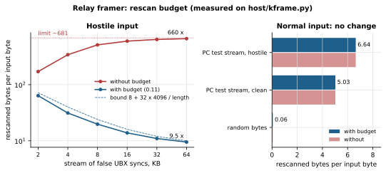
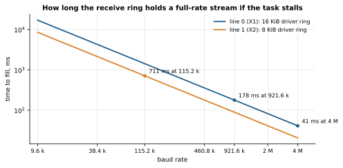

# Relay: UART lines ↔ UDP/TCP

Firmware 0.7.0; two lines since 0.10.0; fixes in 0.11.0.

The module splits the serial stream into **frames**, from the sync bytes to the checksum, and packs whole frames into
UDP datagrams or TCP writes. A frame longer than 512 bytes is cut. Since 0.10 there are two lines: line 0 is the host
port X1 (UART0), line 1 is the second connector X2 (UART1). Each has its own UDP port or TCP client. Roles, defaults
and settings: [NETWORK.md](NETWORK.md). The diagram shows one line; the second works the same way.

```
host ──UART──▶ framer ─┬─ frame with the module's address ──▶ manager (ID_WIFI and common IDs)
                       └─ everything else ──▶ packer (≤512 B) ──▶ packet pool ──▶ send task ──▶ UDP/TCP ──▶ peer
host ◀──UART── transmit ring (whole units) ◀── framer ◀── network task ◀── UDP/TCP ◀── peer
                    ▲ the module's own frames (state, reports, acknowledgements), also as whole units
```


Shared by the two lines:
- the **packet pool** towards the sockets (24 × 512 B) and one send task;
- the **network task**: one `select` over the sockets of both lines. A TCP connect runs in the background of the same
  `select`, so an unreachable peer on one line does not stop reception on the other;
- **frames for the module** are taken from both lines and from the network, even from a sender the line does not relay
  to. The answer goes back the same way ([NETWORK.md](NETWORK.md) §5).

Each line has its own framers and packers in both directions, UART rings and counters.

## Frames

The framer recognises five frame types, each by its own checksum:

| Frame | Start | Length | Check |
|---|---|---|---|
| Kogger KP1 | `BB 55 route mode id len` | `len + 8` | Fletcher‑8 over bytes [2, end−2), as KoggerApp computes it |
| Kogger KP2 | `CC 55 U2(total length)` | from the header, ≤ 4096 | the same |
| u‑blox UBX | `B5 62 class id U2(len)` | `len + 8`, ≤ 4096 | Fletcher‑8 over class…payload |
| MAVLink 1 | `FE len seq sys comp id` | `len + 8` | X.25 + `CRC_EXTRA`; known message id, `len` = base length |
| MAVLink 2 | `FD len incompat compat seq sys comp id[3]` | `len + 12` (+13 signature) | X.25 + `CRC_EXTRA`; only the "signed" flag, `1 ≤ len ≤` max length |

The MAVLink table (392 messages: `CRC_EXTRA`, lengths) is generated by `tools/gen_mavcrc.py` from `all/all.h` of the
generated MAVLink C library (`mavlink/c_library_v2`, MIT license, see [THIRD_PARTY.md](../THIRD_PARTY.md)). Messages
with an unknown id pass as raw bytes.

**The framer** (`kframe.c`) emits two kinds of units:
- **FRAME**, only after its checksum has matched. A frame is held whole, up to 4096 bytes. A KP2 announcing more than
  4096 bytes is treated as noise; KoggerApp's own limit is 384.
- **RAW** bytes: everything that is not a frame, such as noise, other protocols, or a frame with a bad checksum. They go
  in pieces of up to 512 bytes, so an unknown message from one read stays together. After a failed candidate the
  search continues from the next byte, so a false sync in the data does not swallow the real frames behind it.

Nothing is dropped and the order is kept: the concatenation of the units equals the input.

**The packer** (`kpack.c`):
- a packet is at most 512 bytes and consists of whole units;
- a unit that does not fit starts a new packet;
- a unit longer than 512 bytes is cut into 512‑byte pieces, each sent as its own packet.

**Rescan budget** (0.11). Each new input byte earns the right to rescan 8 bytes, and the budget saves up to 32 × 4096.
A failed candidate is rescanned only if the budget covers it; otherwise it goes out raw as a whole.
- A stream made only of false syncs (`B5 62 00 00 F0 0F` repeated, each announcing ~4 KB) makes the framer rescan
  about 660 bytes per input byte without the budget (64 KB stream; the limit is ~681). Any network node could send
  such a stream to a "senders" line, and the core would do nothing else. This is an inference from the algorithm; the
  cycle cost was not measured.
- With the budget the work is bounded by 8 bytes per input byte plus the one‑time saving of 128 KB. That gives 9.5×
  on the same 64 KB stream, approaching 8× on longer ones.
- The PC test streams, deliberately full of sync bytes, need 5–7× and pass without a single refusal to rescan.
- The counter `no_rescan` in `kf_t` counts refusals.

The figures are measured on the Python mirror by `tools/make_charts.py`.



**When a packet leaves:**
- when it is full;
- when the UART has been quiet for a few characters (the driver's pause flag);
- after a long silence: 10–20 ms on the UART side (two ticks of the 100 Hz scheduler), 200 ms on the network side. After a long silence an unfinished
  candidate is abandoned: its first byte goes out raw and the rest is rescanned. So real frames behind a false sync
  with a large announced length are still found.

A gap inside a frame shorter than about 10 ms, e.g. from a USB bridge, does not break it.

**In the other direction** a datagram or a TCP read goes through a framer again. A frame is written to the UART in one
piece, so the module's own frames never land inside a relayed frame. A frame split by the peer across several
datagrams is reassembled.

Checked on the PC (`tests/test_all.py`, 43/43; the C code equals the Python mirror `host/kframe.py` byte for byte):
- all 560 valid frames of a clean stream are found: KP1 277, KP2 64, UBX 75, MAVLink 1 81, MAVLink 2 63 (some signed).
  71 frames longer than 512 bytes went out in 512‑byte pieces that add up to the frame;
- fake MAVLink frames (wrong `CRC_EXTRA`, wrong v1 length) pass as raw bytes;
- in a hostile stream nothing is lost and the order is kept;
- packets are at most 512 bytes, and whole units up to 512 bytes are never cut;
- X.25 check value (CRC‑16/MCRF4XX): `123456789` → `0x6F91`;
- 60 KB of false UBX syncs: C and Python agree, time stays linear.

## Buffers and back‑pressure

| Buffer | Size | On overflow |
|---|---|---|
| UART driver receive ring | 16 KB (40 ms at 4 Mbaud, 180 ms at 921600) | counter `link_ovf`; the receive task has high priority and only copies |
| Frame candidate + rescan queue | 4096 B each, per direction | cannot overflow: longer is not a frame |
| Packet pool to the sockets | 24 × 512 B = 12 KB | the unit is dropped whole (`up_drops`). A frame longer than 512 B gets room for all its pieces at once or is not sent at all (0.11) |
| Network receive | 1500 B (one datagram); lwIP socket queue 16 datagrams (0.11, was 6) | beyond the queue lwIP drops datagrams itself; our counters do not see it |
| Transmit ring to the UART | 12 KB, the last 1 KB only for the module's own frames (0.11) | the unit (frame or raw piece) is dropped whole (`down_drops`); the host never gets a fragment; the module's answers and reports get through under overload |
| UART driver transmit ring | none (0.11; 4 KB before) | the transmit task sleeps on the FIFO semaphore, see below |
| Line 1: UART1 driver receive ring | 8 KB (≈0.7 s at 115200, ≈0.18 s at 460800 at full rate) | line overflow counter (`ID_WIFI_NET` v4) |
| Line 1: transmit ring to UART1 | 8 KB, the last 1 KB for the module's own frames; no driver ring | the unit is dropped whole |
| Line 1: candidates and rescan queues | 4 × 4096 B | allocated only if UART1 runs |



The packet pool is shared by both lines. If the network cannot keep up, the line that finds no room loses units. Since
0.11 a piece of a frame never goes out alone. In 0.10, a frame longer than 512 B could lose some of its pieces when
the pool was nearly empty, and the receiver saw a header without a tail.

**Why the UART driver has no transmit ring** (0.11). In ESP‑IDF 5.5.5, `uart_write_bytes()` with a transmit ring waits
properly only for the transaction header. It polls for data space in a loop without sleeping
(`esp_driver_uart/src/uart.c`, lines 1589–1598).
- The transmit task (priority 11) spun while the UART shifted bytes out.
- With more traffic from the network than the port can carry, the ring never drained. Tasks below priority 11 and the
  idle task got almost no CPU time, and the task watchdog rebooted the module.
- In the field, at 921600 baud with ~92 KB/s arriving from the boat, the module restarted every 20–50 s. The uptime
  dropped to 1 s with no station disconnect.
- The cause is verified in the ESP‑IDF code; its link to the field restarts is an inference.

Without a driver ring, the driver sleeps on the FIFO semaphore, and the buffering comes from the module's own ring of
whole units. Fixed in 0.11. 0.11 runs in the field at 3 Mbaud, but the saturated 921600 case has not been re‑tested.
Check: set the port to 921600 under a stream that exceeds it
for several minutes. The uptime (`ID_WIFI` v1) must not reset, only `down_drops` should grow, and the reset reason at
the end of v1 must not be 6 (task watchdog).

- **UDP:** if the radio does not take a packet, `sendto` fails and the packet counts as lost. There are no retries, as
  is usual for UDP.
- **TCP:**
  - Sending blocks, and the TCP window throttles the stream.
  - A packet not accepted within 5 s means the connection is dead (0.11). In 0.10 one second without progress already
    counted as a break, while lwIP's initial RTO is 1.5 s, so one lost segment dropped the connection.
  - After a send timeout the module reconnects at once; after the peer closes or a connect fails it retries every
    2 s. A connect waits up to 3 s for an answer.
  - One send task serves both lines, so a stuck TCP send on one line delays the other line's packets for that long.
- **Own address:** the module never sends to its own IP (a loop would feed the stream back into the UART) and does not
  write datagrams from its own address to a UART.
- **UART:** at 921600 baud, if the peer sends more than ~90 KB/s, the excess frames are dropped whole (`down_drops`).
  The cure is a faster port; the head unit runs at 3 Mbaud. Hardware flow control RTS/CTS (pins in `menuconfig`,
  off by default) is safe since 0.11: the transmit task sleeps while the host holds CTS.


## Settings: `ID_WIFI` v5, statistics: v6

Since 0.10, v5/v6 are a view of **line 0**; both lines are configured with `ID_WIFI_NET` v3/v4
([SBP_WIFI.md](SBP_WIFI.md) §4).

**SETTING/GETTING v5**, 10 bytes:

| Field | Type | Meaning |
|---|---|---|
| mode | U1 | 0 off, 1 UDP, 2 TCP |
| addr | U1 | the module's own SBP address while relaying |
| ip[4] | U1×4 | peer address; 0.0.0.0 with UDP answers whoever sent (up to 4 senders since 0.10); 255.255.255.255 broadcasts (0.10) |
| rport | U2 | peer port |
| lport | U2 | own UDP port; 0 = same as rport |

- The setting is saved to NVS and applied at once.
- The acknowledgement comes from the **old** address.
- Mode "off" does not change the address (0.11): the address is shared by both lines. Enabling with address 0 is refused
  (ERR_PAYLOAD): at address 0 the module would take the device's frames.
- While the relay is on, the port speaks only SBP. The module answers only frames with its own `addr`; everything else
  goes to the peer.
- The module sends its v1 report by itself from its own address, so KoggerApp finds it as a second device on the same
  port.

The module's address must differ from the address of the device behind it; a sonar is usually 0. The suggested address
is 87.

**GETTING v6**, 47 bytes: `U1 state (0 off, 1 no Wi‑Fi, 2 no peer/connection, 3 ready), ip[4] of the peer, U2 peer
port`, then ten U4 counters:
- up: frames, bytes, packets, drops;
- down: packets, bytes, frames, drops;
- frames for the module itself, TCP connections.

Text command (SLIP mode, bench): `RELAY` shows; `RELAY mode=udp addr=87 ip=10.0.0.10 port=NNNN lport=NNNN` sets. After
enabling, the port switches to SBP.

## Hardware checks and findings

- **0.7.0 in the field:** relay to a boat network over UDP, module at address 87. In 8 s about 270 datagrams and 890
  frames came down without loss.
- **Bug in 0.7.0 and 0.8.0**, found by reading the code (an inference, not reproduced on hardware).
  - With the relay off, the network task waited on `xEventGroupWaitBits(EV_WIFI | EV_RESET)` without clearing the bit.
    While Wi‑Fi was connected, EV_WIFI stayed set, the wait returned at once, and the priority‑9 task spun. The manager
    (priority 6) and the idle task got no CPU time, and after 5 s the task watchdog rebooted the module
    (`CONFIG_ESP_TASK_WDT_PANIC=y`). The module then connected again and the cycle repeated.
  - Only the combination "relay off + Wi‑Fi connected" was affected. With the relay on, the socket is open and the
    task sleeps in receive.
  - To recover a 0.7.0 module in that state, turn the access point off or move away from it (without a connection the
    module answers), then update.
  - Fixed in 0.10.0: with Wi‑Fi up the task waits only for EV_RESET.
- **0.10.0 in the field:** the update from 0.7.0 went through, the relay record moved into line 0, and the boat stream
  flows. The restarts under a saturated 921600 port were seen here (above).
- **0.11.0 in the field:** installed on the head unit's module (3 Mbaud); the saturation check at 921600 is still open.
  Bench check from a PC: `tools/bench_relay.py` (module and PC on one IP
  network; it restores the relay setting at the end) and `tools/bench_sbp.py` (line settings).
