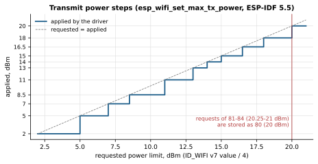

# The module as a Kogger SBP device

Contract version 6 (firmware 0.15.0: every port rate change saved at once; version 5 = 0.14.0: rates up to
5 000 000 baud since 0.13, `ID_WIFI` v1 of 27 bytes; version 4 = 0.12.0, version 3 = 0.11.0, version 2 = 0.10.0, version 1 = 0.2.0). Changes are summarised at the end of §3 and §4
and in [CHANGELOG.md](../CHANGELOG.md). Implementation: `firmware/main/sbp.c`, `sbpdev.c`, `manager.c`, `netctl.c`,
`ports.c`, `portinfo.c`. Python helpers (framing and most payloads): `host/sbpframe.py`. Bench checks:
`tools/bench_sbp.py`, `tools/bench_ports.py`.

A host opens either serial port of the module (X1 or X2; X1 can also be the C3's native USB) and talks plain Kogger SBP
to it, as it would to a sonar. The module answers its own IDs and the common device IDs. The same commands work over the
network ([NETWORK.md](NETWORK.md) §5).

## 1. Frame (KP1)

`BB 55 | route | mode | id | len | payload[len] | ck1 ck2`

- `ck1 ck2`: Fletcher‑8 over the bytes `route … payload`, the same checksum KoggerApp computes (`ProtoBinOut::end()`).
- `mode = type | ver<<3 | mark<<6 | resp<<7`. `type`: 1 CONTENT, 2 SETTING, 3 GETTING. Multi‑byte fields are
  little‑endian.
- A GETTING request is answered by a CONTENT of the same version, except `ID_WIFI` v3, which is answered with
  CONTENT v0. A CONTENT may grow in later firmware (new fields are
  only appended), so **parse CONTENT by minimum length, not exact length**.
- A SETTING request (with `resp` = 1, as KoggerApp sends it) is acknowledged by a CONTENT with `resp` = 1, the same
  version and the payload `{code, ck1, ck2}`. `ck1 ck2` is the checksum of the acknowledged SETTING frame, which is
  what KoggerApp compares in `IDBin::checkResponse()`. Codes: 1 OK, 3 ERR_PAYLOAD, 5 ERR_VERSION, 6 ERR_TYPE, 7 ERR_KEY,
  8 ERR_RUNTIME.
- IDs the module does not know are ignored silently, as sonars do. The `mark` bit is set after `ID_MARK` and cleared by
  a reboot and by `ID_BOOT` v0 (update window).

## 2. Address, identity, ports

- **Two equal ports** (0.12). X1 (line 0) and X2 (line 1) work the same way: the module answers on either, in either
  role, whether its line bridges to the network or not.
- **Address** (`route`): **87 in the station role, 88 in the access‑point role**, or the address set with
  `ID_WIFI_NET` v6 or `ID_UART` v1/v2 (1–254, saved at once). It does not depend on bridging (0.12; before, the
  module sat on 0 while no line bridged). The module takes SETTING and GETTING with its own address from any channel
  and never relays them.
- **Discovery** (0.12). A GETTING `ID_VERSION` addressed to **0 or 255** is answered from the module's own address to
  the channel it came from, and is still relayed like any other frame, so a device behind the module answers too.
  KoggerApp looks for devices exactly this way (`ID_VERSION` to address 0 when a port opens, then to every known
  device about every 300 ms), so it finds the module on either port in either role. No other frame to 0 or 255 is
  taken by the module: a SETTING to address 0 stays the device's.
- **Replies go where the request came from.** Acknowledgements and answers go back on the request's channel: X1, X2,
  or the network sender, from the same UDP port. Scan results (v2) go to whoever started the scan.
- **Unsolicited frames** — state changes (v0), the periodic report (v1), v7 after a connection, update progress — go to
  **every channel that sent the module a request within the last 60 s**: each port on its own, plus the last network
  sender (0.12; before, only the channel of the last request). A port that never asks the module anything, such as a
  sonar's, receives nothing from it. KoggerApp keeps asking every known device, so its port stays subscribed.
- **`ID_VERSION` (0x20):**
  - v0, 34 bytes: `[1]` = board **87**, `[14..17]` = serial number (lower 4 bytes of the MAC);
  - v1, 12 bytes: UID (MAC followed by zeros);
  - v2, 9 bytes: `bootMode (0 firmware, 1 while the update window or a transfer is open), boardMinor 0, board 87, 0, 0,
    U2 0, fwMinor, fwMajor`.
- **`ID_UART` (0x18)**, KoggerApp's `IDBinUART` layout. SET v0 `{KEY 0xC96B5D4A, U1 1, U4 baud}`.
  - Any rate from 9600 to 5 000 000 is accepted on either port (0.13; 4 000 000 before), including all standard ones
    (9600 … 921600, 1 000 000, 1 200 000, 1 500 000, 2 000 000, 2 500 000, 3 000 000, 3 500 000, 4 000 000, 5 000 000).
    5 000 000 is the ESP32‑C3 UART limit and exact from its 80 MHz clock (divider 16); it has not been run on hardware.
  - v0 refers to the port behind the request: the UART it came through, or, for a network sender, the UART of the
    line whose UDP port received it. The `uart` byte is ignored (KoggerApp always sends 1).
  - The acknowledgement goes out at the old rate, then the port switches.
  - **Saving, the same for both ports** (0.15): every change is applied and **saved at once**, whichever port or the
    network asked. A host that switched the module to a rate it cannot follow gets the module back by holding BOOT for
    5 s: both ports return to 921600 ([HARDWARE.md](HARDWARE.md#resets-with-the-boot-button-013)). Up to 0.14 a change
    of the port the request came through was provisional: saved only when a request arrived through that port at the
    new rate (or with `ID_FLASH` v0), otherwise the port went back after 10 s.
  - Default rates: 921600 on both ports (on KoggerApp's auto‑detect list). X2's was 115200 before 0.13; a module set
    up under an earlier firmware keeps 115200 on X2 after the update, a new or factory‑reset one takes 921600.
  - GET: v0 → `{KEY, 1, baud}` of that port, v1 → `{KEY, 1, address}`, v2 → `{KEY, address}`. SET v1
    `{KEY, U1 1, U1 address}` and v2 `{KEY, U1 address}` both set the module's own address (saved at once, the same
    as `ID_WIFI_NET` v6); 0 and 255 → ERR_PAYLOAD. The acknowledgement comes from the old address.
  - The rate of the other port is set with `ID_WIFI_NET` v3 (saved at once). Saved rates are port settings: the "forget
    lines" flag of a role change keeps them.
- **`ID_MARK` (0x21):** SET v0 `{KEY}`; GET v0 → `{U1 mark}`.
- **`ID_FLASH` (0x23):** SET `{KEY}`. v0 confirms and saves the current rates of both ports and the report period; v1
  reloads the saved report period (saved rates apply at the next boot); v2 erases the saved rates (both 921600
  at the next boot) and the report period.
- **`ID_BOOT` (0x24):** SET v0 `{KEY}` reboots the module after a 5 s update window.
  - A reboot brings back the **saved** rates.
  - Only an update, and a role change with reboot, carry the current rates over one boot. The address is always the
    saved one (0.12; 0.11 also carried the address over).
- **Firmware update is accepted only over a wired line**, X1 or X2 (UART or native USB, 0.11). `ID_UPDATE` and `ID_BOOT` v1 from the network get
  ERR_RUNTIME. SBP has no authentication and the image is not signed ([UPDATE.md](UPDATE.md), [SECURITY.md](../SECURITY.md)).

2, 3 and 4 Mbaud were verified with `ID_UART` v0 on the UART of an RK3588 head unit. KoggerApp's "Set baudrate" list
(`DeviceSettingsPage.qml`) ends at 2 000 000 as of September 2026; a host that needs a higher rate sends `ID_UART`
itself.

## 3. `ID_WIFI` = 0x57

| Version | GETTING | SETTING |
|---|---|---|
| v0 | state (CONTENT v0) | — (ERR_TYPE) |
| v1 | link report (CONTENT v1) | `{U2 period_ms}`: 0 off, otherwise 100…60000 (clamped, no error); then CONTENT v1 |
| v2 | start a scan → one CONTENT v2 per network | the same, plus an OK acknowledgement; ERR_RUNTIME in the AP role |
| v3 | state (CONTENT v0) | connect `{U1 flags, U1 len, SSID, U1 len, password}`; ERR_RUNTIME in the AP role |
| v4 | saved networks → one CONTENT v4 each | action `{U1 code, …}`; codes 0 and 1 are ERR_RUNTIME in the AP role |
| v5 | relay settings of line 0 (10 bytes) | `{U1 mode 0/1 UDP/2 TCP, U1 own address, ip[4], U2 peer port, U2 own port}`, see [RELAY.md](RELAY.md) |
| v6 | relay statistics of line 0 (47 bytes) | — (ERR_TYPE) |
| v7 | radio: power and mode (8 bytes) | `{U1 power in 0.25 dBm 8…80, U1 protocols, U1 bandwidth 1/2, U1 power save 0/1/2}` |

**CONTENT v0: state** (39 bytes + SSID). Sent on request and **by itself on every state change**.

| Offset | Field |
|---|---|
| 0 | U1 state: 0 IDLE, 1 SEARCHING (looking for saved networks), 2 CONNECTING, 3 CONNECTED, 4 AP (access‑point role, AP running) |
| 1 | U1 flags: bit0 auto‑connect, bit1 scan running, bit2 current network is saved |
| 2 | S1 RSSI, dBm (0 when not connected) |
| 3 | U1 channel |
| 4 | U1 security: 0 OPEN, 1 WEP, 2 WPA, 3 WPA2, 4 WPA/WPA2, 5 WPA3, 6 WPA2/WPA3, 7 ENTERPRISE, 8 OWE, 255 other/unknown |
| 5 | U1 last disconnect reason (ESP‑IDF `wifi_err_reason_t`) |
| 6 | U1 category: 0 NONE, 1 NO_AP (network not found), 2 AUTH (wrong password), 3 ASSOC, 4 LOST, 5 OTHER |
| 7 | U1 number of AP clients (AP role); 0 in the station role |
| 8–13 | BSSID |
| 14–17 / 18–21 / 22–25 / 26–29 | IP / netmask / gateway / DNS, bytes a.b.c.d |
| 30–33 / 34–37 | U4 receive / transmit traffic, **bytes per second** |
| 38 | U1 SSID length, then the SSID (up to 32 bytes, not necessarily UTF‑8) |

In the AP role, v0 describes the module's own access point:
- SSID and channel are the AP's own;
- security is 0 OPEN, 3 WPA2 or 6 WPA2/WPA3;
- BSSID is the AP's MAC;
- IP and netmask are the AP's address, the gateway equals the AP address, DNS is 0;
- RSSI is that of the weakest client (0 without clients).

**CONTENT v1: link report** (27 bytes since 0.14, 23 since 0.11, 22 before). Sent **by itself once per period**
(1000 ms by default) while the channel is in SBP mode: `U1 state, S1 RSSI, U4 rx_Bps, U4 tx_Bps, U4 rx_total,
U4 tx_total, U4 uptime_s, U1 last reset reason, U4 requests dropped`. Totals wrap at 2³². In the AP role RSSI is that
of the weakest client. A host reads the fields its length has and ignores the rest.

**Requests dropped** (0.14) counts requests the module could not queue: its control queue (64 messages, 8 of them kept
for Wi‑Fi events) stayed full for 20 ms. It should stay 0. Up to 0.13 the queue held 24 and a full one dropped the
request at once and silently; the receiving tasks outrank the manager, so a burst of requests (KoggerApp sends one when
it opens a port) could lose some, and more right after power‑up, when Wi‑Fi events share the queue.

The reset reason is ESP‑IDF's `esp_reset_reason_t`: 1 power‑on, 3 software (`esp_restart`: update, role change, the
`ID_BOOT` window), 4 panic, 5 interrupt watchdog, **6 task watchdog**, 7 other watchdog, 9 brownout, 14 power glitch,
15 CPU lockup, 0 unknown. An uptime that drops to zero shows a restart; this byte shows its cause without the text console.

**Traffic** counts the bytes of frames that the module's Wi‑Fi interface received and sent (Ethernet header + IP
packet, as lwIP sees them) over exactly 1 s. It is the real Wi‑Fi traffic, whatever data path runs on top.

**CONTENT v2: one network from a scan** (13 bytes + SSID), sorted by descending RSSI: `U1 index, U1 total, S1 RSSI,
U1 channel, U1 security, U1 flags (bit0 saved, bit1 current), BSSID[6], U1 len, SSID`. No networks: one frame `{0, 0}`.
- A scan takes about 2–4 s.
- A scan is impossible during a connection attempt: the answer is an ERR_RUNTIME acknowledgement.
- If the scan is aborted (by a connection or a driver reconnect) or does not finish within 15 s, the same
  ERR_RUNTIME comes instead of a partial list (0.11).
- The results, and the ERR_RUNTIME of an aborted scan, go only to the channel that started the scan. A second
  SETTING v2 from the same channel during a running scan is acknowledged with OK and shares the results; from another
  channel it gets OK but no results. A second GETTING v2 has no acknowledgement of its own: from the same channel it
  receives the results, from another channel nothing.

**SETTING v3: connect.** Flags bit0 = save the network; it is saved only after an IP address is obtained. SSID 1–32
bytes, password 0–64. The OK acknowledgement comes at once; the progress shows in CONTENT v0. On failure the state
goes to SEARCHING or IDLE with the reason code and category (wrong password → AUTH). Hidden networks connect only
through an explicit v3.

**CONTENT v4: one saved network**: `U1 index, U1 total, U1 len, SSID`; none: `{0, 0}`. Up to 8 networks. Passwords are
never sent out. **SETTING v4: action**:
- `{0}` disconnect and turn auto‑connect off;
- `{1}` turn auto‑connect on;
- `{2, U1 len, SSID}` forget a network (unknown → ERR_PAYLOAD);
- `{3}` forget all.

**v7: radio** (firmware 0.8.0). SETTING, 4 bytes:

| Field | Values |
|---|---|
| U1 power | transmit power limit in 0.25 dBm, 8…80 (2…20 dBm); 81…84 are accepted and stored as 80 |
| U1 protocols | 0x01 b, 0x03 b/g, 0x07 b/g/n, 0x08 LR, 0x0F b/g/n + LR (LR is Espressif's long‑range mode) |
| U1 bandwidth | 1 = 20 MHz, 2 = 40 MHz (only together with 11n) |
| U1 power save | 0 off, 1 MIN_MODEM, 2 MAX_MODEM |

CONTENT v7 (on GETTING, after SETTING, and since 0.11 by itself after every connection and AP start), 8 bytes: the
same 4 fields, then `U1 power in effect (0.25 dBm), U1 mode negotiated with the AP (0 LR, 1 11b, 2 11g, 4 HT20, 5 HT40,
0xFF no link), U1 protocols set in the driver, U1 bandwidth set in the driver`.

- **The real channel width is byte 5** (4 = HT20, 5 = HT40). Bytes 6–7 report what the driver interface is set to
  (`esp_wifi_get_protocol/bandwidth`), not what was negotiated. A module set to 40 MHz shows 40 in byte 7 while the
  link runs HT20 (verified in the field). Since 0.11 the module compares bytes 6–7 with the setting after every start
  and connection, and re‑applies the setting if they differ.
- A CONTENT v7 right after a SETTING that changes protocols or bandwidth carries the state **before** the reconnect
  (`phy` = 0xFF). The real state follows by itself after CONNECTED (0.11).
- **Power.** The driver applies power in steps: 2, 5, 7, 8.5, 11, 13, 14, 15, 16.5, 18, 20 dBm
  (`esp_wifi_set_max_tx_power`, ESP‑IDF `esp_wifi.h`). That is why the module reports both the set and the applied
  value. Power is re‑applied after every connection, because country information from the AP may lower it.
- **Protocols and bandwidth** take effect at the next connection, so the module reconnects to the same network at once.
- **LR** works only with an access point on an Espressif chip with LR enabled. The combination "b/g/n + LR" has not
  been tested on hardware.
- The settings are saved in NVS and applied at power‑up. Defaults: 20 dBm, b/g/n, 20 MHz, no power save. The driver does
  not go above 20 dBm, so 0.11 stores 80 instead of 84 and "set" equals "in effect".
- Text command (SLIP mode, bench): `RADIO` shows; `RADIO power=15 mode=bgn bw=20 ps=none` sets.
- **In the AP role** (0.10) protocols and bandwidth apply to the access point, and changing them restarts it 0.2 s after
  the answer (0.11). Power save is not applied: an access point must listen to its clients. The negotiated mode is
  0xFF. "LR only" is allowed in the AP role (0.12; 0.11 refused it): only Espressif stations with LR, such as another module set to LR or b/g/n + LR, can join such an AP; no phone or laptop can, and a wrong setting is undone over a wire or from such a station.

**Changes to `ID_WIFI` in 0.11:**
- v1 is one byte longer (reset reason);
- v7 comes by itself after a connection, bytes 6–7 are named correctly, power goes up to 80;
- LR‑only is refused in the AP role (allowed again in 0.12);
- v2 answers whoever asked and never returns a partial list;
- v5 with mode "off" no longer touches the module's address, and enabling with address 0 is refused.

## 4. `ID_WIFI_NET` = 0x58 (firmware 0.10.0)

Role, access point, address and DHCP, UART lines and their ports. The model is in [NETWORK.md](NETWORK.md).

- **Every SETTING starts with the key** `U4 0xC96B5D4A`; without it the answer is ERR_KEY. It works like `ID_UART`,
  because these settings can cut the module off.
- Every SETTING is acknowledged, then the module sends a CONTENT with what is now in effect.
- Settings are saved to NVS at once.

| Version | GETTING | SETTING (after the key) |
|---|---|---|
| v0 | role: `{U1 at next boot, U1 now}`, 0 station, 1 AP | `{U1 role, U1 flags}`: bit0 reboot right after the answer, bit1 forget lines and own address (the new role starts from its defaults) |
| v1 | access point: `{U1 channel 1–11, U1 hidden 0/1, U1 max clients 1–10, U1 security 0 open/1 WPA2/2 WPA2+WPA3, U1 len, SSID, U1 0}` | the same, ending with `U1 len, password` (8–63; empty for open). An empty password with security on keeps the old password |
| v2 | address: `{ip[4], mask[4], U1 DHCP, pool start[4], pool end[4], U2 lease min, U1 offer: bit0 gateway, bit1 DNS}` (20 bytes) | the same 20 bytes |
| v3 | line (18 bytes): `{U1 line, U1 mode 0 off/1 UDP/2 TCP, U1 dest 0 fixed/1 senders/2 broadcast, ip[4], U2 rport, U2 lport, U4 baud, S1 TX, S1 RX, U1 uart}`. No payload: both lines; `{U1 line}`: one | the first 17 bytes of the record. `baud` (0.12) changes the other line's rate, or either line's when asked from the network, and is saved at once; 0 or the running rate keeps it. For the line of the port the request came through `baud` is ignored: that port's rate is changed with `ID_UART` v0. Pins apply to line 1 only (line 0: the build) |
| v4 | line statistics (57 bytes); no payload: both, `{U1 line}`: one | — (ERR_TYPE) |
| v5 | AP clients: `{U1 index, U1 total, MAC[6], ip[4], S1 RSSI}` each; none: `{0, 0}` | — (ERR_TYPE) |
| v6 | own address `{U1}` | `{U1 address 1–254}` (0 and 255 → ERR_PAYLOAD); acknowledged from the old address |
| v7 | port information (0.12, §4.1): `{}` both ports, `{U1 port}`, `{U1 port, U1 page}` | — (ERR_TYPE) |

- **v0.** The role takes effect at boot. With the reboot flag, the module carries the current rates over one boot, as
  after an update. The address after the reboot is the saved one, otherwise the new role's default (87 station, 88
  access point); a host finds it again with discovery (0.12; the 0.11 carry‑over of the address, and its known issue
  with address 0, are gone).
- **v1.** The network name can be changed at will.
  - To change only the name, take the fields from a GETTING v1, put in the new name and send it with an empty password.
    With security on, the password stays. Example for the name `Boat-1`, WPA2, channel 6, up to 4 clients:
    `4A 5D 6B C9 | 06 00 04 01 | 06 'B' 'o' 'a' 't' '-' '1' | 00`.
  - In the station role the setting is only saved and takes effect in the AP role.
  - In the AP role the AP restarts 0.2 s after the answer; clients disconnect and join again.
  - The password is never read back: the answer carries password length 0.
  - **Channel 1–11** (0.11; 0.10 allowed 1–13). The driver's default country ("01") gives an AP no other channels.
    With channel 12–13 the driver would refuse the configuration, and after a reboot its own open AP could come up
    (inference from the ESP‑IDF documentation; the driver is closed source). 0.10 records with channel 12–13 are
    clamped to 11 when 0.11 boots.
  - If the driver still refuses a configuration, 0.11 restores the previous one; at boot it uses the built‑in
    defaults. If even those are refused, the radio does not start at all. There is never an open AP.
- **v2.** Validation rules: [NETWORK.md](NETWORK.md) §3. In the AP role the change applies 0.2 s after the answer, and
  all clients are disconnected so they take a new lease.
- **v3.** `uart`: 0 UART off, 1 running on these pins, 2 the saved pins take effect after a reboot. Both lines report
  their running rate (the saved one while the UART does not run); line 0 carries the build's pins (−1/−1 in the USB
  variant). An error in any field → ERR_PAYLOAD and nothing changes. Writing back a record read earlier never moves the
  rate of the port the host sits on, even when the rate has changed since.
- **v4.** The payload starts with `{U1 line, U1 state 0 off/1 no Wi‑Fi/2 no peer/3 ready, ip[4], U2 peer port,
  U1 senders}`, then twelve U4 counters:
  - up: frames, bytes, packets, drops;
  - down: packets, bytes, frames, drops;
  - frames addressed to the module, TCP connections, UART receive overflows, UART transmit drops.

  The peer is the fixed/TCP peer, the broadcast address or the last sender.
- **v6** is the same field as `addr` in `ID_WIFI` v5. 0 and 255 are refused: 0 is where devices sit by default, 255 is
  the broadcast route.
- All eight versions of `ID_WIFI_NET` are in use (v7 since 0.12).

**Changes to `ID_WIFI_NET` in 0.11:**
- AP channel 1–11; 0.10 records with channel 12–13 are clamped to 11;
- a configuration the driver refuses falls back to the previous one, at boot to the defaults, else the radio stays
  off: never an open AP;
- v6 with address 0 → ERR_PAYLOAD;
- v0 with reboot: the address in use is carried over one boot even while a line bridges (0.10 switched to the
  bridging address); see the known issue under v0;
- a disabled DHCP server stays disabled after an AP restart.

**Changes in 0.12:**
- the two ports are equal: the module answers on X1 and X2 in either role;
- fixed own address (87 station / 88 access point, or v6), independent of bridging; 255 refused like 0; no address
  carry‑over at a role reboot;
- discovery: GETTING `ID_VERSION` to 0 or 255 is answered from the own address and relayed;
- unsolicited frames go to every channel that asked within 60 s;
- v3 sets the rate of the other line (or of either line from the network), saved at once; the asking port's rate is
  changed with `ID_UART` v0 (§2; provisional up to 0.14);
- unsolicited frames reach every subscriber even while a request from another channel is handled;
- the reboot into a new image still leaves the address for a 0.11 image (unused by 0.12), so a rollback to 0.11 over
  SBP comes back at the address the host talks to;
- v7: port information (§4.1);
- `ID_WIFI` v7: "LR only" is allowed in the AP role, for module‑to‑module links.

### 4.1 Port information (v7, 0.12)

GETTING v7 without payload → page 0 of both ports; `{U1 port}` → page 0 of that port; `{U1 port, U1 page}` → that
page. Port 0 = X1, 1 = X2; pages 0–2; anything else → ERR_PAYLOAD. SETTING → ERR_TYPE. Firmware 0.11 answers GETTING v7
with ERR_VERSION. Every answer is a CONTENT v7 `{U1 port, U1 page, …}`; ages are in 0.1 s, 0xFFFF = never or
≥ 6553.5 s. Nothing here changes any traffic: the module only watches what passes (`firmware/main/portinfo.c`).

**Page 0, summary** (116 bytes):

| Offset | Type | Field |
|---|---|---|
| 0 | U1 | port |
| 1 | U1 | page = 0 |
| 2 | U1 | flags: bit0 UART running; bit1 bridging (the line is on); bit2 **the request for this page came through this port**; bit3 the port gets the module's unsolicited frames; bit4 locked to SLIP (IP bridge, X1 only); bit5 rate provisional (up to 0.14; never set since 0.15) (waiting for confirmation); bit6 USB transport (X1 in the USB variant) |
| 3 | U4 | current rate (0 = UART off) |
| 7 | U4 | saved rate |
| 11 | U1 | connected, judged over the last 10 s: 0 nothing; 1 unreadable bytes (another rate or an unknown protocol); 2 SBP host; 3 SBP device(s); 4 SBP host and devices; 5 MAVLink; 6 u‑blox; 7 IP bridge host (SLIP); 8 other framed traffic |
| 12 | U4 | bytes received |
| 16 | U4 | bytes sent |
| 20 | U2 | age of the last byte received |
| 22 | U2 | age of the last byte sent |
| 24 | 6 × 10 | per protocol, in the order KP1, KP2, UBX, MAVLink 1, MAVLink 2, raw: `{U4 units from the port, U4 units to the port, U2 age of the last one from the port}` |
| 84 | U4 | SBP requests (SETTING/GETTING) from the port |
| 88 | U4 | SBP CONTENT from the port |
| 92 | U4 | SBP requests to the port |
| 96 | U4 | SBP CONTENT to the port |
| 100 | U4 | requests to the module that came through the port |
| 104 | U4 | the module's own frames sent to the port |
| 108 | U4 | receive overflows |
| 112 | U4 | transmit drops |

- A host sends requests, a device answers with CONTENT: that is how "connected" tells them apart. Units are whole
  frames as the relay cuts them ([RELAY.md](RELAY.md)); raw units are runs of bytes that are not such frames.
- Bit2 tells a host which port it sits on; the rest tells it what is on the other one.

**Page 1, devices heard from the port** (3 + 12·n bytes, n ≤ 8, the most recent first): `{U1 port, U1 page = 1,
U1 n}`, then n entries `{U1 kind: 1 SBP device, 2 MAVLink system; U1 SBP address or MAVLink sysid; U1 board (SBP,
0 unknown) or compid; U1 firmware major (SBP) or MAV_TYPE; U1 firmware minor (SBP) or MAV_AUTOPILOT; U1 flags: bit0
SBP version known, bit1 MAVLink heartbeat seen; U2 age; U4 serial (SBP, from ID_VERSION v0; 0 unknown) or frames seen
(MAVLink)}`. Board and firmware come from `ID_VERSION` answers that pass through the port (v2: board and firmware,
v0: board and serial); type and autopilot from a HEARTBEAT. When the table is full the stalest entry makes room.

**Page 2, network side of the port's line** (5 + 8·n bytes, n ≤ 4): `{U1 port, U1 page = 2, U1 line mode 0 off/1 UDP/
2 TCP, U1 line state as v4, U1 n}`, then n entries `{ip[4], U2 port, U2 age of the last data from it}`: the fixed, TCP
or broadcast peer, or the senders a `senders` line answers.

Bench check of all of this on hardware: `tools/bench_ports.py`.

## 5. X1: SBP and the IP bridge

X1 also understands SLIP frames for the IP bridge ([PROTOCOL.md](PROTOCOL.md), daemon `host/espwifi_bridge.py`); X2
carries SBP only.
- The first valid frame after power‑up locks X1's protocol until the next reboot: an SBP frame for the module (its own
  address or discovery) selects SBP, a SLIP frame selects SLIP.
- In SBP mode the module is silent on SLIP, and in SLIP mode on SBP.
- Until the protocol is locked, in the station role the module sends SLIP text notifications (`* HELLO` at boot,
  `* STATE` on changes). KoggerApp's parser skips those bytes as noise.
- In the AP role (0.11) no text is sent before the host locks SLIP, because a device may sit on X1.
- The text command `PROTO link=sbp` switches SLIP → SBP without a reboot.
- While line 0 bridges (0.7+), the port is locked to SBP from the start. On factory settings (0.13) it bridges in
  either role, so the IP bridge needs line 0 switched off first.

## 6. ID choice

`ID_WIFI` 0x57, `ID_WIFI_NET` 0x58 and board ID 87 were unused in KoggerApp when they were chosen
(September 2026). 0x57 ("W") sits in the middle of the empty range 0x41–0x63, away from the groups KoggerApp extends
one by one; 0x58 is its neighbour.
