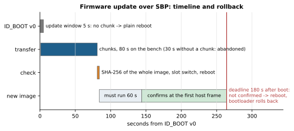

# Firmware update

The module's firmware is updated over the same port, with the same Kogger SBP exchange that KoggerApp uses for
devices with a Kogger bootloader: `ID_BOOT v0` → `ID_UPDATE` chunks → `ID_BOOT v1`. The application side of the
procedure is in KoggerApp (`src/device/dev_driver.cpp`). The module answers
the way that code expects; this was checked against its source and on hardware (test log below).

## File

`tools/make_update.py` turns a built image into `dist/KoggerWiFi_<version>.ufww`. The file is the ESP‑IDF application
image unchanged: it already carries the chip id, project name, version and a SHA‑256 of the whole image. The script
checks in advance what the module will check.

KoggerApp needs one change to pick the file: add `*.ufww` to the file dialog filter (`qml/app/DeviceSettingsPage.qml`,
`upgradeFileDialog.nameFilters`, which lists `*.ufw`). The different extension is deliberate: `.ufw` is the
encrypted container of Kogger bootloaders, and the two should not be confused.

## What the module does

1. **`ID_BOOT v0` (with key)** opens a 5 s "bootloader window". `ID_VERSION v2` reports `bootMode = 1`, and the mark bit
   is cleared, as after a reset. If no chunk arrives within 5 s the module reboots. That is why KoggerApp's "Reboot"
   button, which sends the same frame, still reboots the module, only 5 s later.
2. **`ID_UPDATE v0`** `{U2 number, data ≤ 253 bytes}`. Every chunk is answered with
   `CONTENT {U2 lastNumMsg, U4 lastOffset, U1 type, U1 rcvNumMsg}`.
   - A chunk is accepted only if its number is `lastNumMsg + 1`. A repeat of an accepted chunk, or a chunk after a
     missing one, is answered with `type 2`, and the application continues from `lastNumMsg + 1` / `lastOffset`.
   - Fatal codes: 3 no session, 4 foreign image, 5 image larger than the slot, 6 flash write error.
   - A transfer that stalls for 30 s is abandoned; the old firmware keeps running.
   - Code 6 also comes while the running firmware has not confirmed itself yet: the spare slot is not erased while a
     rollback may still need it.
3. **`ID_BOOT v1` (with key)** checks the whole image (`esp_ota_end`: segments and SHA‑256).
   - Only if the check passes is the slot selected for boot; the module answers OK and reboots.
   - Otherwise the answer is ERR_RUNTIME and nothing changes.
   - After an abandoned transfer (stalled, fatal code), `ID_BOOT` v1 also answers ERR_RUNTIME (0.11).
   - With nothing received (the window open without a chunk, or no transfer at all) it answers OK and does not
     reboot; in the window it closes the window.
4. **After the reboot** the new firmware is "pending verification".
   - It confirms itself once it has received at least one frame addressed to it (from any channel: X1, X2 or the
     network) or a SLIP control (text) line, and has run for **60 s** (0.11; 5 s before). IP packets over the
     bridge do not count.
   - If that has not happened within 180 s (`CONFIG_WB_OTA_CONFIRM_S`), it reboots and the bootloader returns to the
     previous image.
   - The minute of work lets a release roll back even when it fails later, e.g. when connecting to an access point,
     on the first relayed traffic, or when a client joins. So do not power the module off during the first minute
     after an update: it would return to the previous firmware.
5. **Wired only** (0.11): `ID_UPDATE` and `ID_BOOT` v1 from the network get ERR_RUNTIME. SBP has no authentication, the
   key is public, the image is not signed, and anyone who knows the Wi‑Fi password can become a client.



## Why it is safe

| Risk | Protection |
|---|---|
| Power lost during writing | Only the inactive slot (`ota_0`/`ota_1`) is written; the running image is untouched and the boot pointer changes at the very end |
| Foreign or damaged file | The first 256 bytes stay in RAM until proven: an ESP‑IDF image, chip ESP32‑C3, project `headunit_wifi_bridge`. Only then is the slot erased. At the end, a full SHA‑256 check before switching |
| Lost or repeated chunk | Strictly `last + 1`; a mismatch answers `type 2` and the application moves its cursor. The frame checksum rejects corruption |
| Bytes lost while flash is erased | The UART interrupt handler runs from IRAM (`CONFIG_UART_ISR_IN_IRAM`) and keeps working with the cache disabled |
| New firmware boots but does not work | Bootloader rollback (`CONFIG_BOOTLOADER_APP_ROLLBACK_ENABLE`) unless the new image runs 60 s with host frames within 180 s. A crash or hang in that minute (task watchdog: panic → reboot) also ends in a rollback |
| False rollback because of another baud rate or address | Before rebooting into the new image, the current rate and address are written to NVS for one boot, and the new firmware comes up with them (the address fix is from 0.11) |
| Accidental start | `ID_BOOT` only with the key `0xC96B5D4A`; `ID_UPDATE` outside the window is refused with code 3 |
| Firmware from the network | Refused since 0.11: only X1 or X2 |

Not done: signature checking. The module accepts any correctly built image of this project. For protection against
foreign builds, the next step is signed ESP‑IDF images (RSA‑3072, `CONFIG_SECURE_SIGNED_APPS_NO_SECURE_BOOT`) and a
decision on where the private key lives.

## How to update

From KoggerApp (after the filter change): select the module → "Upgrade" → `KoggerWiFi_<version>.ufww`.

Without the application, from any PC:

```
python tools/sbp_update.py --port COM3 dist/KoggerWiFi_0.11.0.ufww
```

What the script does:
1. It reads the full version, the slot and the rollback state (`tools/fwinfo.py`, text `VER` over SLIP).
2. It updates the module with KoggerApp's exchange.
3. It keeps talking to the new firmware for a little over a minute, until the new firmware has run for 65 s
   (0.11 confirms after 60 s).
4. It reboots the module and checks the full version, the slot change and `ota=valid`, then hands the port back to SBP.

An unconfirmed image would roll back exactly at that reboot, so the check also proves the confirmation.
- The port rate must be the saved one (`ID_FLASH` v0). Reboots come back at the saved rate, and the script would lose
  the module otherwise.
- Pass a rate other than 921600 with `--baud`.

**A port that speaks only SBP: `--sbp-only`.** While line 0 bridges (0.7+), the port understands only SBP, and the SLIP
question of `fwinfo.py` never reaches the module. With `--sbp-only`:
- the version is read with `ID_VERSION`, which carries only `major.minor`, so the script refuses a file with the same
  second number;
- the SLIP frame `PROTO link=sbp` is not sent, because the relay would forward it to the network as raw bytes;
- confirmation is proven by a reboot through `ID_BOOT` v0 (update window, 5 s, reboot) after 65 s of the new firmware.
  The bootloader would roll an unconfirmed image back at that reboot, and a reset uptime (`ID_WIFI` v1) shows the
  reboot really happened;
- the slot and rollback state are not visible this way.

```
python tools/sbp_update.py --port /dev/ttyUSB0 --baud 2000000 --route 87 --sbp-only dist/KoggerWiFi_0.11.0.ufww
```

The script follows the module's address: it takes it from the module's `ID_VERSION` answer (board 87). A 0.12 module
answers `ID_VERSION` to address 0 from its own address, so `--route` is needed only for a 0.11 module whose line
bridges (then its bridging address, 87 by default). An update that moves the address, such as a 0.11 station at 0 to
0.12 at 87, is followed. A 0.12 module also leaves its address for a 0.11 image at the reboot, so a rollback to 0.11
comes back where the host talks to it.

**Do not switch the relay off to make SLIP answer.** On 0.7.0/0.8.0 a module with the relay off and Wi‑Fi connected
reboots every ~10 s ([RELAY.md](RELAY.md)).

**Updating from 0.10 to 0.11 needs the new `sbp_update.py`.** The old script reboots the module 6 s after the update;
0.11 confirms only after 60 s, so that reboot would roll the new firmware back.

**Versions.** `ID_VERSION v2` carries only `fwMajor.fwMinor`, one byte each. KoggerApp checks an update by them, so
**every release raises the second number** (0.4 → 0.5). The third number shows only in `VER` over SLIP, which is not
enough for the application. Version 0.9 is taken by a test image, so the release after 0.8 is 0.10.

The first installation of the update mechanism (firmware 0.1/0.2 → 0.3) needed one flash over the cable, because the
bootloader and the partition table changed. The NVS partition stayed in place, so saved networks survived.

## Test log

Bench: CP2105 USB‑UART adapter at 921600 baud.

| Test | Result |
|---|---|
| First installation of the mechanism over the cable (v0.3.0: rollback bootloader + two‑slot table) | PASS: a saved network survived the change |
| 0.3.0 → 0.3.1 with KoggerApp's exchange | PASS: 885 120 bytes in 80 s (10.8 KB/s), `ID_BOOT v1` → OK; after two reboots `fw=0.3.1 part=ota_1 ota=valid` |
| 0.3.1 → 0.4.0, chunk 7 lost | PASS: one cursor reposition (`type 2`), image intact: `fw=0.4.0 part=ota_0 ota=valid` after the reboot; 151 s, since after a reposition KoggerApp's procedure sends one chunk at a time |
| A byte corrupted in chunk 300 | The module stayed on `0.4.0 ota_0 valid`: it refused correctly. The script printed "ID_BOOT v1 → OK", a bug of the script: it picked up the acknowledgement of the v0 step from the start of the transfer (found in the 0.11 review). The script is fixed; the `--corrupt` run should be repeated |
| Abandoned transfer, rollback of an unconfirmed image | not run yet (`--stop`, `--expect-rollback`; test images: [BUILD_AND_TEST.md](BUILD_AND_TEST.md) §7) |
| 0.7.0 → 0.10.0 in the field, over a saturated 921600 port, `--sbp-only` | PASS, 5/5 checks: 929 KB in 226 s; the relay record moved into line 0 and the link to the boat came back |
| 0.10.0 → 0.11.0 in the field, 3 Mbaud, `--sbp-only` | PASS, 7/7 checks: 932 512 B in 50.4 s (18.1 KB/s), no repositions; confirmed after 65 s and a proving reboot; all settings kept |
