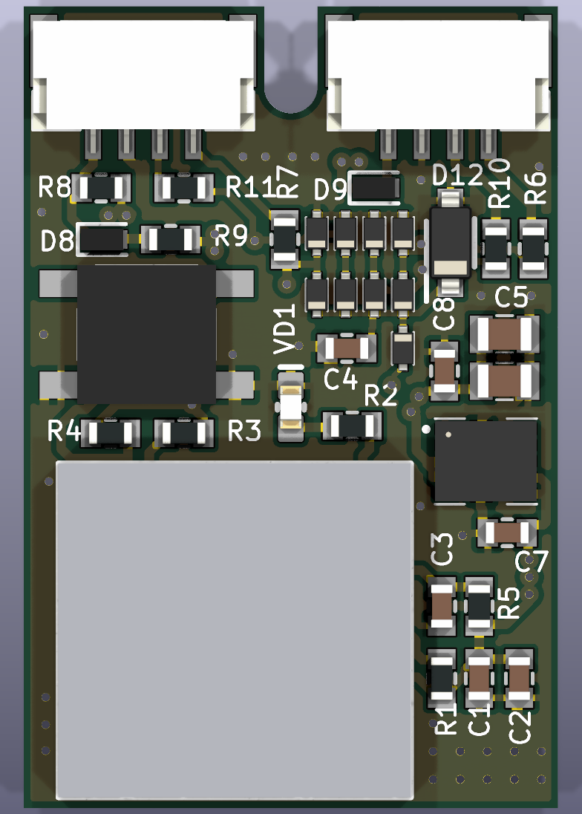
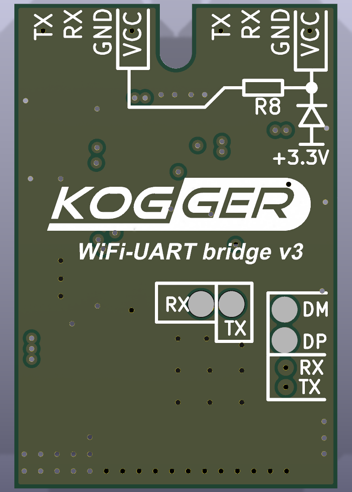

# Hardware: Wi‑Fi UART bridge board v3

KiCad 10 project of the reference board, the board that was manufactured and is in use. Every drill hole
and every solder‑paste opening of this board matches the fabrication files the board was made from (checked, see
below).

 

| File | Contents |
|---|---|
| `WiFi_UART_Bridge_v3.kicad_pro` | project (open this in KiCad 10 or later) |
| `WiFi_UART_Bridge_v3.kicad_sch` | schematic, one A4 sheet |
| `WiFi_UART_Bridge_v3.kicad_pcb` | board: 20 × 30 mm, 4 layers |
| `WiFi_UART_Bridge.kicad_sym`, `WiFi_UART_Bridge.pretty/` | project symbol and footprint libraries (`sym-lib-table`, `fp-lib-table`) |
| `3d/` | plain box bodies for renders (module, switch, 4 A diodes); other parts use KiCad library models |
| `outputs/WiFi_UART_Bridge_v3_schematic.pdf` | schematic |
| `outputs/WiFi_UART_Bridge_v3_fab.zip` | Gerbers, Excellon drill, drill map, Gerber job file, pick‑and‑place, BOM |
| `outputs/WiFi_UART_Bridge_v3_bom.csv`, `_pos.csv` | BOM and pick‑and‑place (top side, mm, origin at the lower‑left board corner) |

The outputs are generated by `python tools/make_hw_outputs.py` (needs `kicad-cli` of KiCad 10).

## Board

| | |
|---|---|
| Size | 20 × 30 mm, a 2 mm wide, 4 mm deep notch with a rounded end between the two connectors |
| PCB | 4 layers, FR4 1.2 mm, 18 µm copper, ENIG finish, green solder mask, white silkscreen |
| Stackup in the file | nominal: 0.2 mm prepreg, 0.708 mm core, 0.2 mm prepreg; use the fab's standard 1.2 mm 4‑layer stackup |
| Layers | F.Cu: signals and GND pour; In1.Cu: GND; In2.Cu: VCC, +3.3 V and UART routing plus a GND pour; B.Cu: GND pour and the test pads |
| Design rules | track 0.2 mm min, clearance 0.2 mm, vias 0.7/0.3 mm (82), copper to edge 0.25 mm |
| Components | 37 on the top side; 4 test pads on the bottom |

## Circuit

- **Module U1:** ESP32‑C3‑MINI‑1U with a U.FL connector for an external 2.4 GHz antenna. The EN pin has a 10 kΩ
  pull‑up and 1 µF to GND (power‑on delay). The strapping pins GPIO2, GPIO8 and GPIO9 have 10 kΩ pull‑ups.
  The BOOT button SB1 pulls GPIO9 low.
- **Power:**
  - VCC arrives on X1 pin 4 through the Schottky diode D9 (SDM4A40EP3, reverse‑polarity protection).
  - The step‑down module U2 (TI LMZM23601V3: 4–36 V in, 3.3 V out, up to 1 A per TI) makes +3.3 V.
  - VCC range: 4.5–24 V (rated; not measured on a board). The lower limit is the regulator's 4 V plus the diode
    drop; the upper limit stays below the 25 V rating of the input capacitors C5/C6.
- **X2 pin 4 (VCC_X2):** two 0 Ω links. R8 connects it to VCC. R9 + D8 feed it from +3.3 V through a Schottky
  diode. Both links are fitted in the BOM, so X2 pin 4 carries VCC; with R8 left out it carries about 3 V. Through R8
  the board can also be powered from X2 pin 4, without the reverse‑polarity diode.
- **UART protection:** each line has a series resistor on the connector side, 150 Ω on TX and 1 kΩ on RX. On the
  module side, Schottky diodes (BAS3005B‑02V) clamp each line to GND and to a clamp rail 3.3S. D1 feeds that rail from
  +3.3 V; the 3.3 V Zener D12 and C4 absorb the clamp current, so over‑voltage on a connector does not pump up +3.3 V.
- **LED VD1:** GPIO0 → 1 kΩ → green LED → GND, lit when GPIO0 is high. The firmware does not use it yet.
- **Test pads on the bottom (1.6 mm):** TP1 DM (GPIO18, USB D−), TP2 DP (GPIO19, USB D+), TP3 TX and TP4 RX of line 1
  (GPIO5/GPIO4). The USB pads allow flashing through the C3's USB Serial/JTAG.

| Connector | Pin 1 | Pin 2 | Pin 3 | Pin 4 |
|---|---|---|---|---|
| X1 (line 0) | TX (GPIO21) | RX (GPIO20) | GND | VCC in (through D9) |
| X2 (line 1) | TX (GPIO5) | RX (GPIO4) | GND | VCC_X2 |

X1 and X2 are JST GH 4‑pin headers, 1.25 mm, right angle (SM04B‑GHS‑TB). The mating housing is GHR‑04V‑S.
The bottom silkscreen names the pins.

## How the KiCad project was checked

1. **Board:**
   - footprints in one project library with plain names;
   - courtyards on U1, U2, X1, X2 and SB1 and fab outlines on U2, X1, X2 and SB1; the passives, diodes and LED have
     silkscreen outlines only, the test pads none (the board's DRC does not require courtyards);
   - footprints linked to their schematic symbols by UUID;
   - KiCad library 3D models, aligned by fitting the library footprint's pads onto these pads (residual ≤ 0.1 mm),
     plus three plain boxes;
   - stackup 1.2 mm, 18 µm copper, ENIG, green solder mask, white silkscreen;
   - drill/place origin at the lower‑left corner.
2. **Connectivity:** the schematic netlist and the board partition all 134 pins into the same 32 nets. The only board
   pads without a symbol pin are 14 unconnected NC pads of U1.
3. **Against the fabrication files of the manufactured board:**
   - all 82 drill holes match (≤ 0.0005 mm);
   - all 152 top and 4 bottom solder‑paste openings match in position (≤ 0.0004 mm) and size;
   - in the original pick‑and‑place file 33 of 37 parts match exactly. For D8, D9, X1 and X2 that file gives a body
     centre instead of the footprint origin; their pads are among the matched paste openings.
4. **ERC:** clean. **DRC with schematic parity:** no parity errors, no unconnected items, no clearance errors.
   Remaining items are inherited from the original layout:
   - 1 error: C3 pad 2 has a single thermal spoke into the top GND pour after the zones are refilled;
   - 26 warnings: silkscreen text 0.7 mm high, below KiCad's default minimum of 0.8 mm;
   - 3 warnings: silkscreen over copper.

Changes to the content of the original design, all visible in the files:
- The four bottom test pads were free pads in the original layout. They are now test points TP1–TP4 in the schematic
  and on the board, excluded from the BOM and the pick‑and‑place.
- PWR_FLAG symbols and a "Power flags for ERC" block were added, as KiCad's ERC requires. U2's DNC and PGOOD pins got
  no‑connect marks.
- Part data come from the production BOM: value, manufacturer part number, manufacturer. Fields of the original part
  database (stock, storage location, local datasheet paths, distributor links) were not carried over.
- The original schematic's database item for D1, D3, D4, D6, D7, D10, D11, D13, D14 was SDM05A30CP3‑7. The production
  BOM and the footprint (SC‑79) use BAS3005B‑02VH6327, and so does this project.
- ERC ignores "off grid" in this project: the ESP32 module symbol has its pins on a 2.5 mm pitch.
- The board's copper‑to‑edge constraint is 0.25 mm: the layout keeps connector mounting pads (at 0.25 mm), stitching
  vias and a few tracks 0.25–0.48 mm from the edge.
- Solder mask: green in this project; the first production run of board v3 used blue.
- A duplicate set of connector labels outside the board outline on the front silkscreen was removed.

## License

The hardware design files are published under the same MIT license as the rest of the repository
([../LICENSE](../LICENSE)). KiCad library symbols embedded in the schematic, the symbol `VCC_X2` of the project library
(derived from KiCad `power:VCC`) and the KiCad 3D models the board refers to are covered by the KiCad libraries'
license ([../THIRD_PARTY.md](../THIRD_PARTY.md)).

The KOGGER logo on the bottom silkscreen of the board is not licensed under the MIT License. The fab zip in
`hardware/outputs` includes it: before making boards that KOGGER LLC does not supply, delete the logo from B.SilkS
and regenerate the outputs with `tools/make_hw_outputs.py`.
